# Googleアナリティクスのプロジェクトを作成

Googleアナリティクスは、Webサイトやアプリにどんな人が訪れているのかといった「属性データ」や、サイト内でどんなページを見てどのような行動をしているのかといった「行動データ」を分析して、サイト改善へと繋げることができるアクセス解析ツールです。

今回はGoogleアナリティクスを使ってWebアプリのロギングを行います。

## 操作手順

https://developers.google.com/analytics?hl=ja にアクセスし、「アナリティクスに移動」をクリック

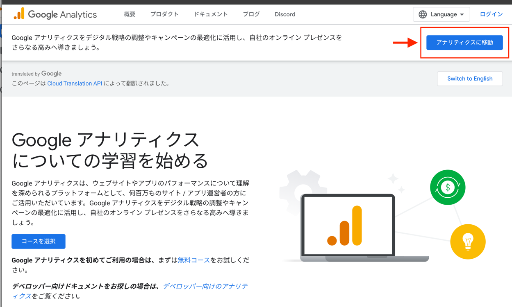

ログイン画面に遷移した場合は、事前に用意したGoogleアカウントでログインをする。

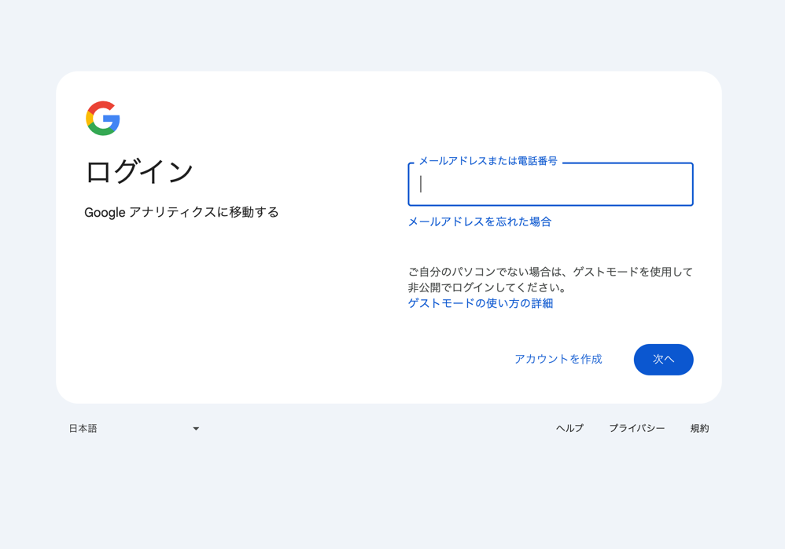

「測定を開始」をクリック

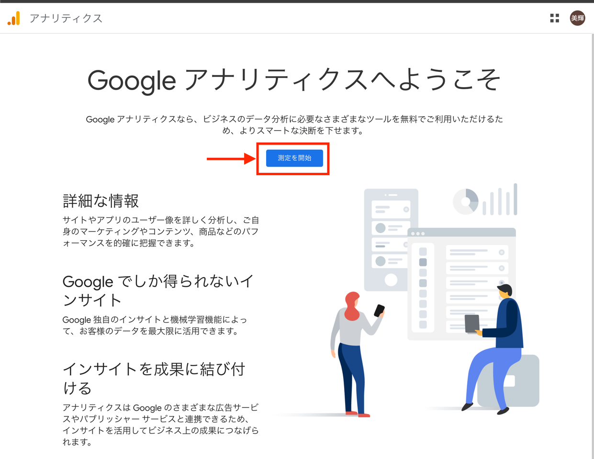

アカウント名を入力。アカウント名はなんでもよい。 こだわりがなければ今回は「k-tachibana-{自身の名前}」を入力し、「次へ」をクリック。

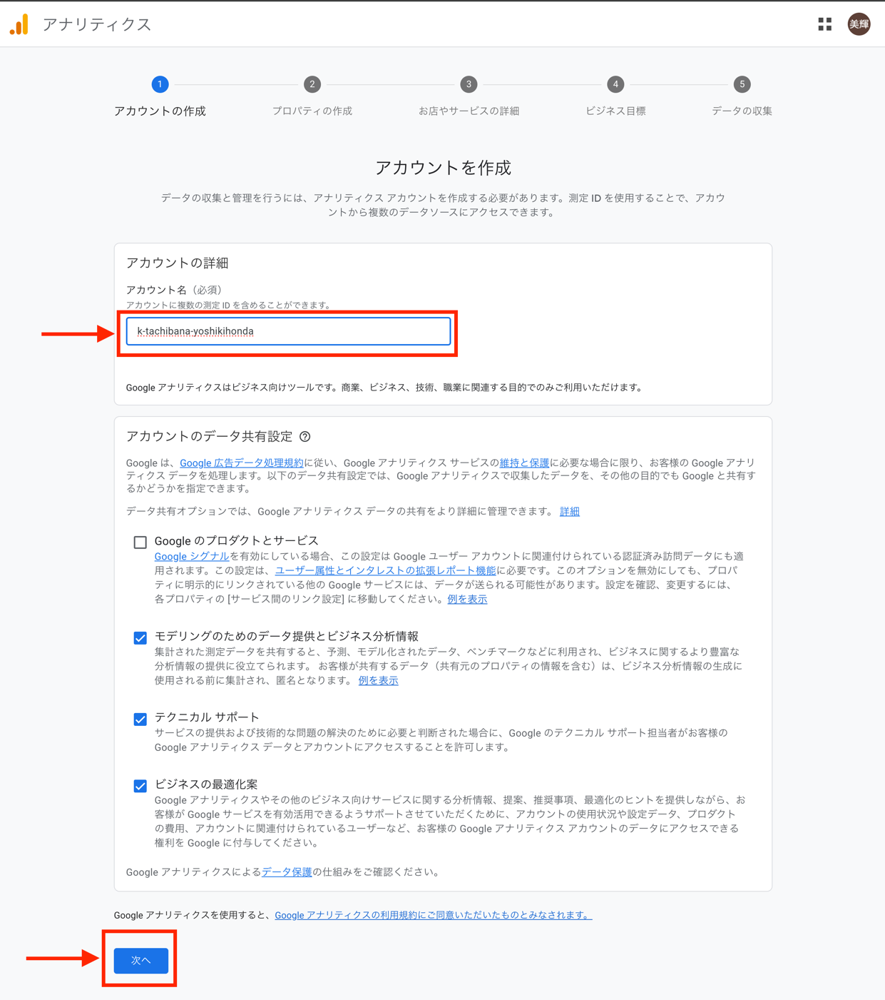

プロパティ名を入力。プロパティ名は一般的には解析したいWebサイトやアプリを示す名前を入れることが多い。今回は「k-tachibana-{自身の名前}」を入力し、レポートのタイムゾーンを「日本」に設定、通貨を「日本円」に設定し「次へ」をクリック

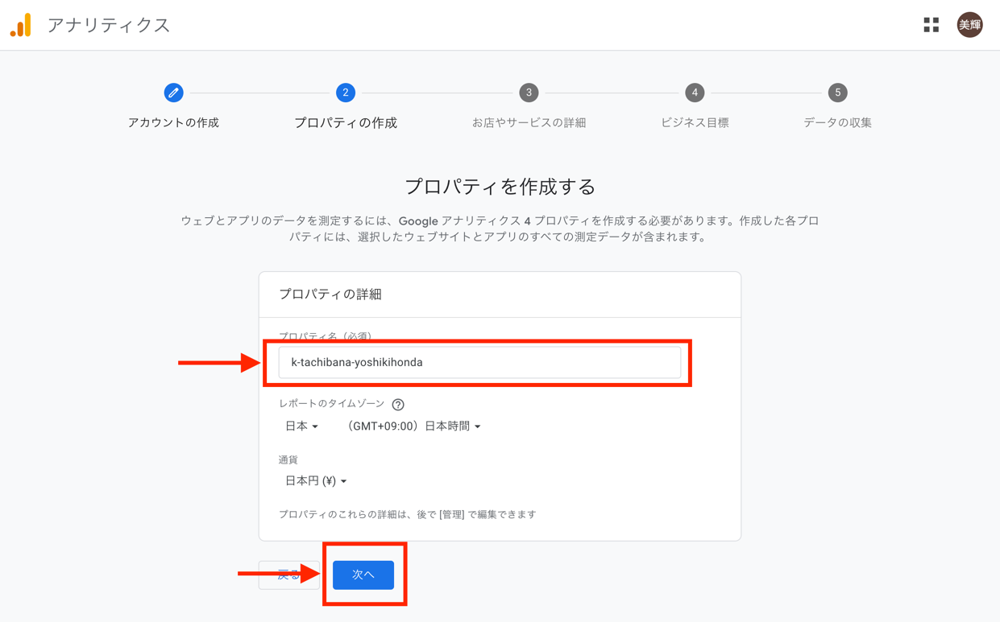

ビジネスの説明を入力。今回は「仕事、教育」、「小規模」を選択し「次へ」をクリック

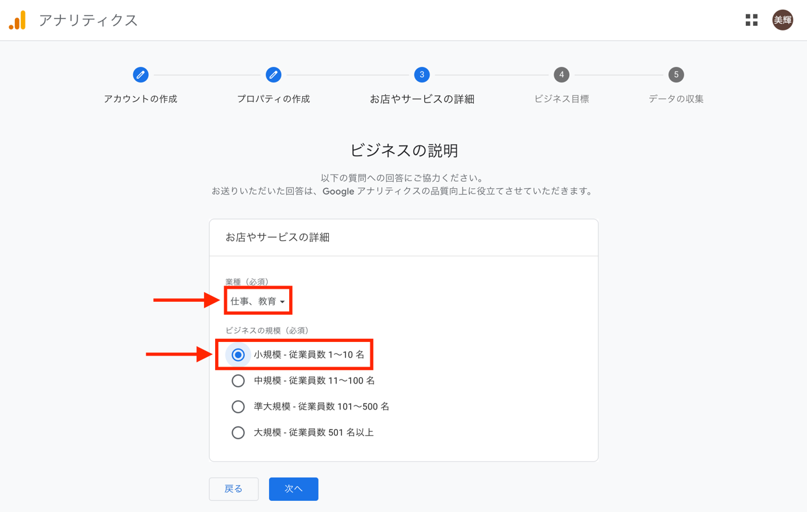

ビジネス目標を入力。今回は「ユーザー行動の調査」を選択し「作成」をクリック

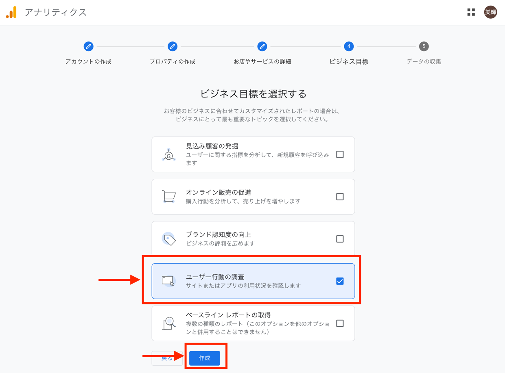

Googleアナリティクス利用規約に同意する。

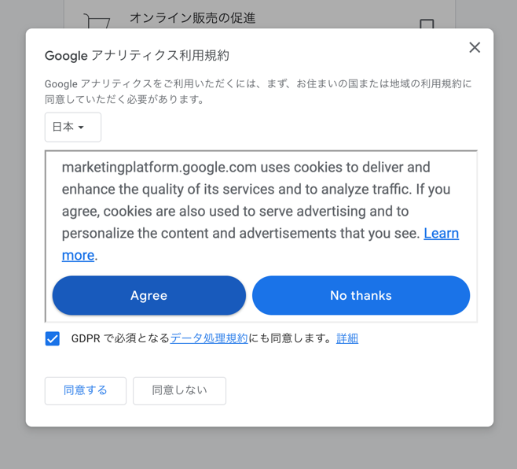

これでGoogleアナリティクスのプロジェクト作成は完了しました。最後に「データ収集を開始する」と表示されWebアプリの登録が促されますが、まだWebアプリは作成していないので「今回はスキップ」をクリック。

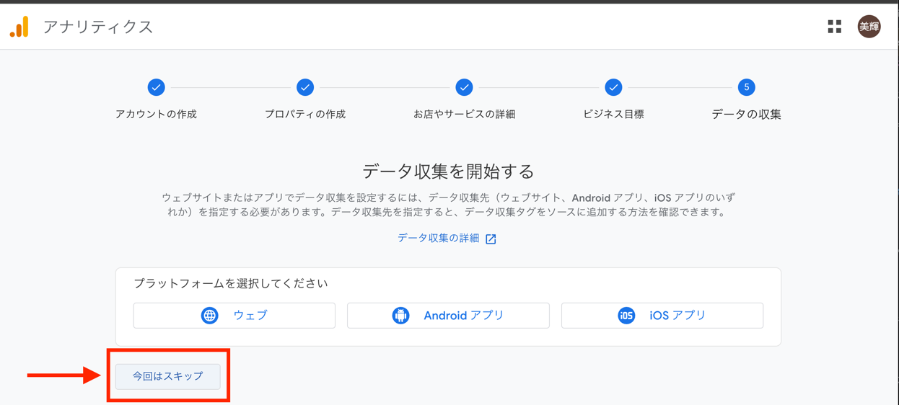

「ホームに移動」をクリック。

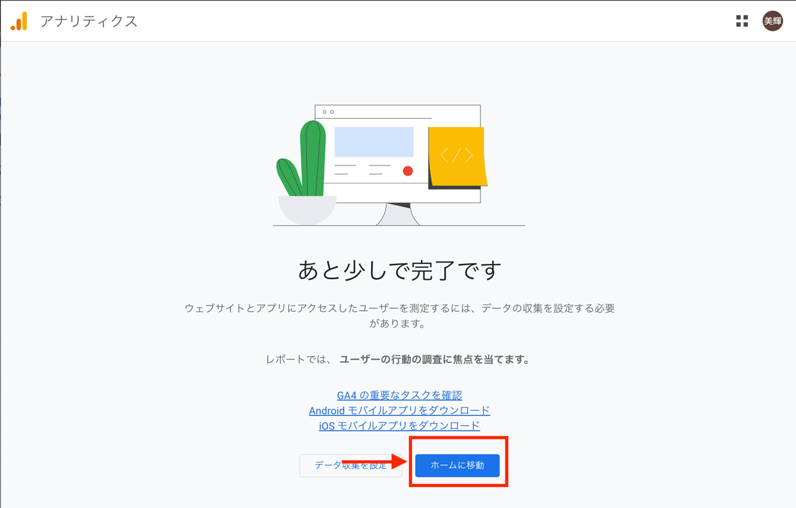

ダッシュボードが作成されたらひとまず完了

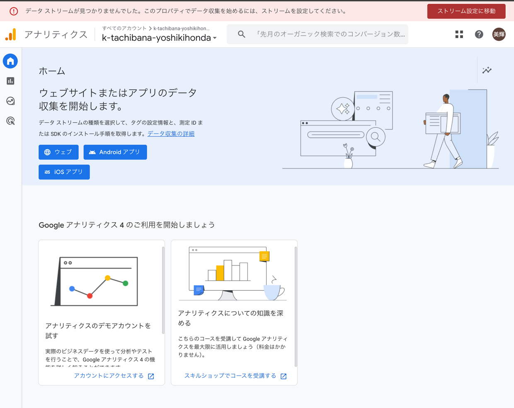