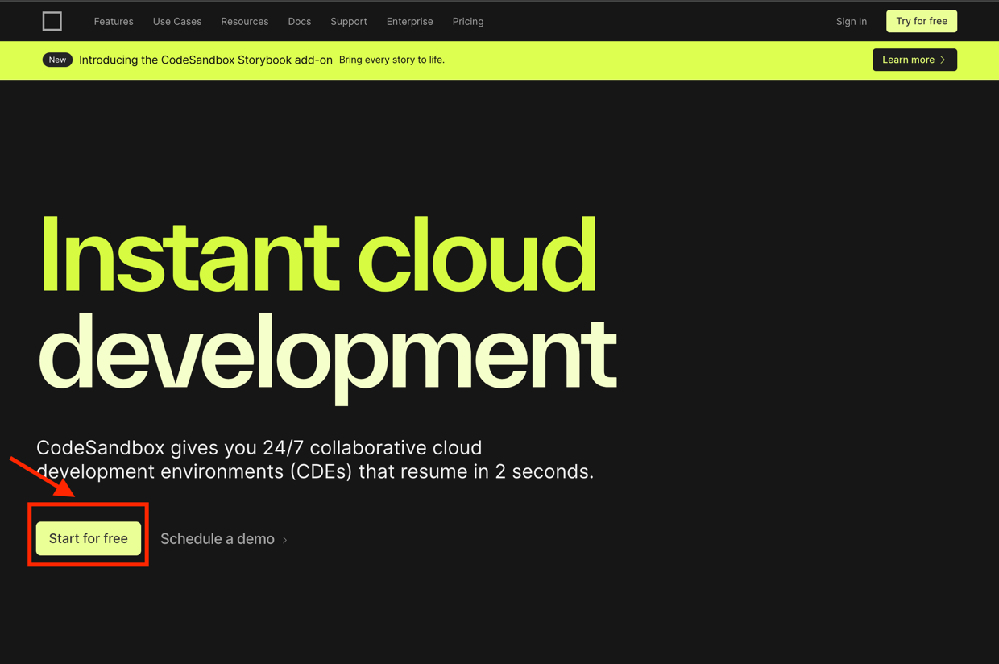
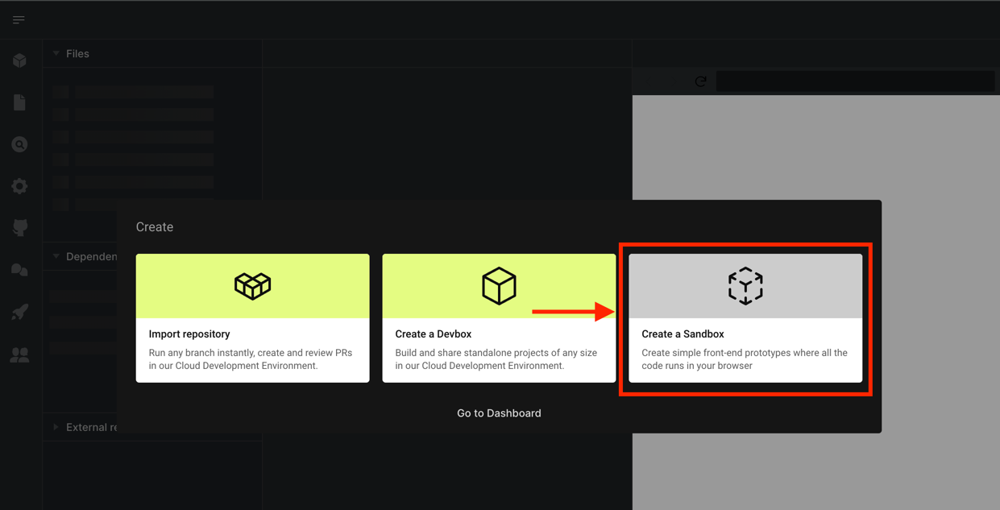
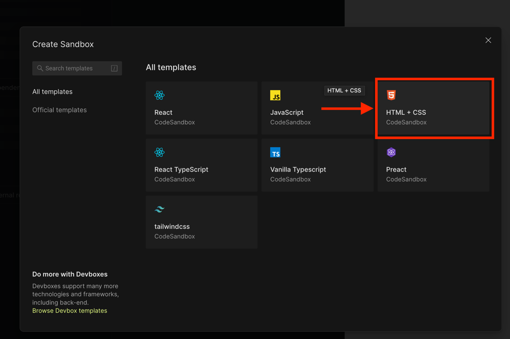
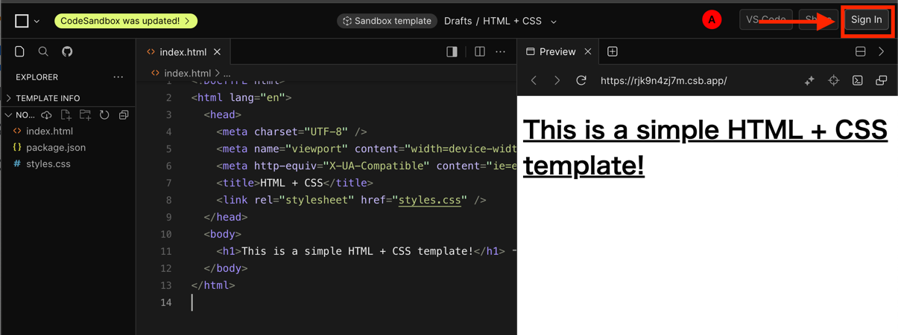
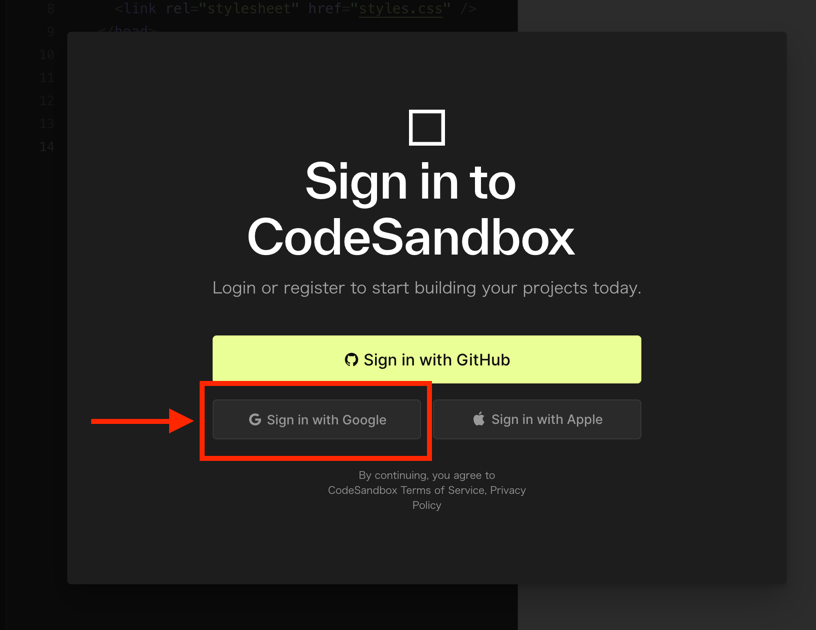
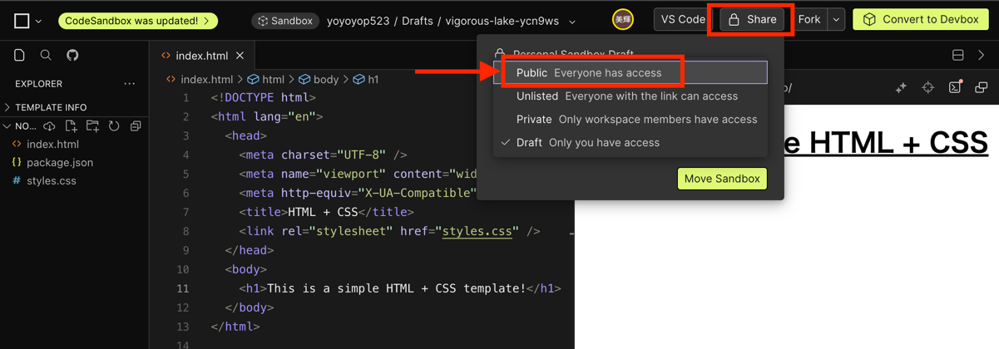
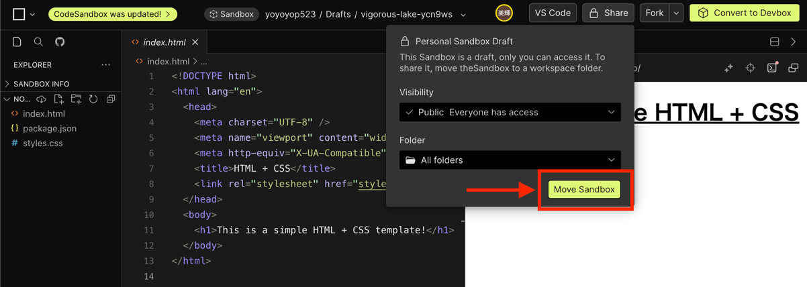
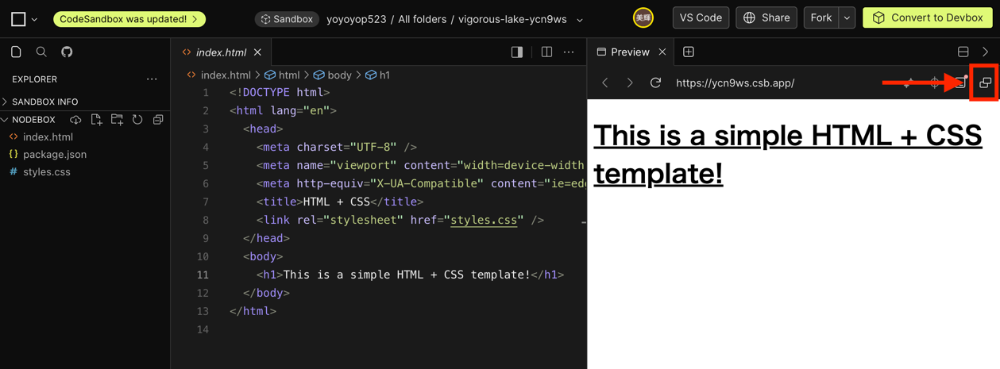
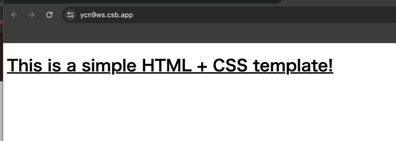

# 3. Webアプリを作成

今回はCodeSandboxを使ってWebアプリを作成します。CodeSandboxはブラウザ上でWebアプリを開発できるツールです。

## 操作手順

[https://codesandbox.io/](https://developers.google.com/analytics?hl=ja) にアクセスし、「Start for free」をクリック

「Create a Sandbox」をクリック

「HTML + CSS」をクリック

まだログインしていないため、このままではファイルを編集できない。 「Sign in」をクリックし、「Sign in with Google」をクリックして自身のGoogleアカウントでログイン。

次にWebアプリを誰でもアクセスできるようにします。「Share」から「Visibility」をPublicにし、「Move Sandbox」をクリックします。

以下のアイコンをクリックすると、別タブでWebアプリが表示されます。

これでWebアプリ開発の準備は完了です。
