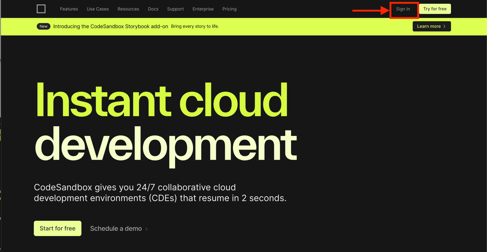
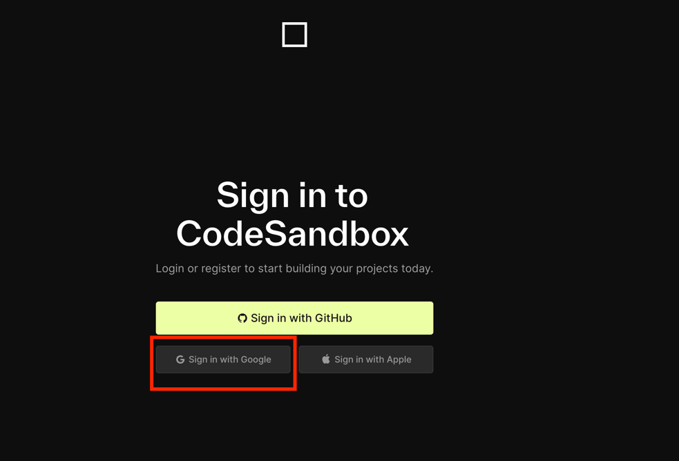
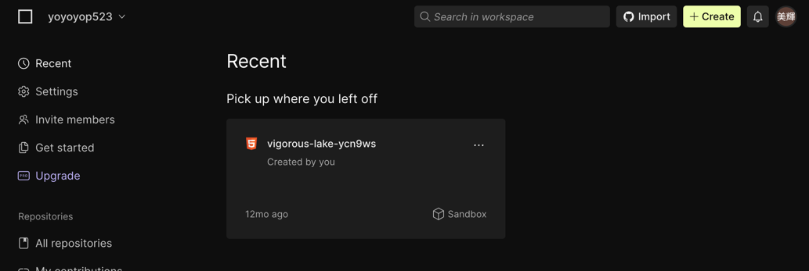
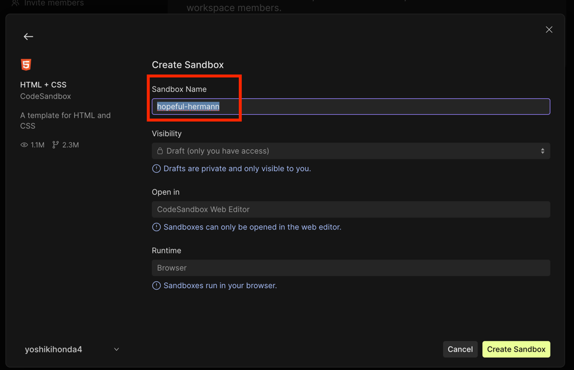

# 3. Webアプリを作成

今回はCodeSandboxを使ってWebアプリを作成します。CodeSandboxはブラウザ上でWebアプリを開発できるツールです。

## 操作手順

[https://codesandbox.io/](https://codesandbox.io/) にアクセスし、「Sign In」をクリックし、Googleアカウントでログインする。

ダッシュボードにて「+Create」をクリック

「HTML + CSS」をクリック

「Sandbox Name」を適当に設定（デフォルトのままでも良い）して「Create Sandbox」をクリック

次にWebアプリを誰でもアクセスできるようにします。「Share」から「Visibility」をPublicにします。

以下のアイコンをクリックすると、別タブでWebアプリが表示されます。

これでWebアプリ開発の準備は完了です。
