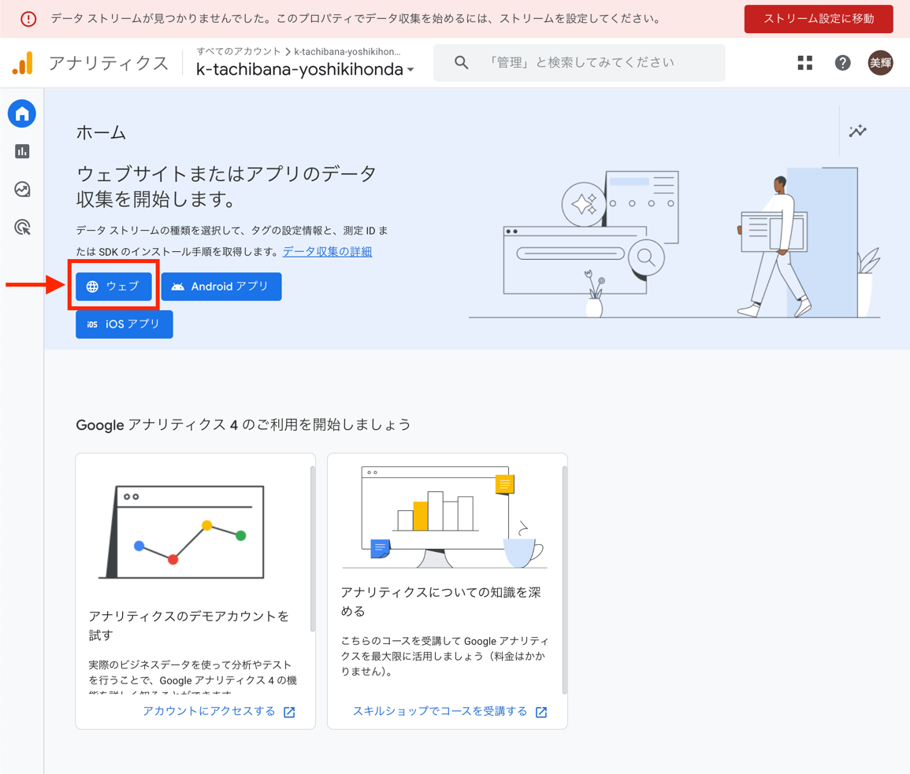
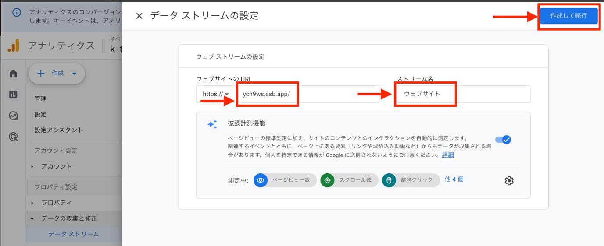
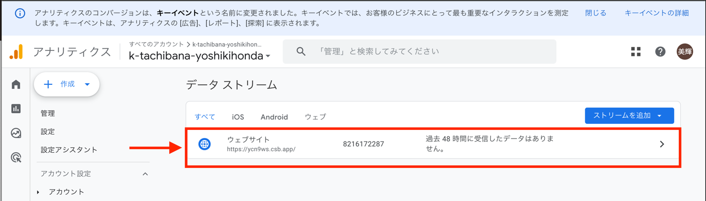
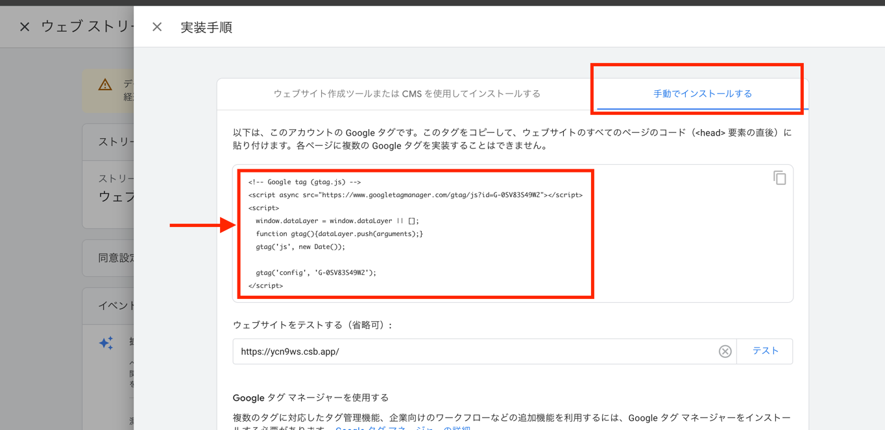
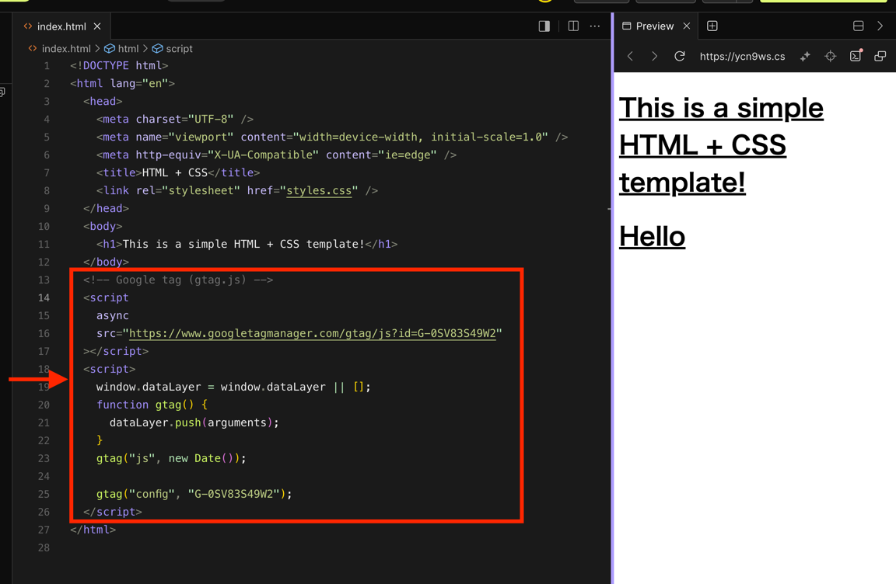
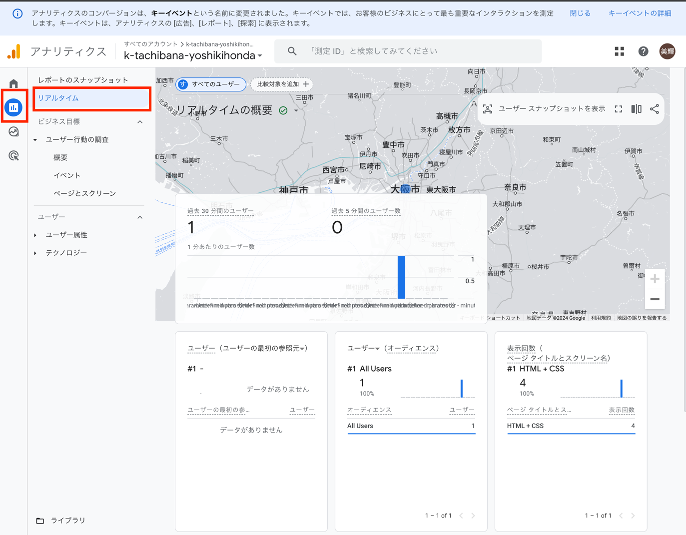

# 4. Googleアナリティクスとの紐付け

Googleアナリティクスにて、先ほど作成したWebアプリのデータ収集を始める。

## 操作手順

ダッシュボードにて「ウェブ」を選択

「ウェブサイトのURL」に先ほど作成したWebアプリのURLを入力し、「ストリーム名」に「ウェブサイト」と入力し、「作成して続行」をクリック。

作成したデータストリームを選択。

「タグの実装手順を表示する」をクリック。

「手動でインストール」タブを開き、そこで表示されているコードをコピーする。

CodeSandboxにて、先ほどコピーしたコードをbodyタグの下に貼り付けて保存する。

一度作成したWebアプリにアクセスしてみてください。その後Googleアナリティクスのダッシュボードで、リアルタイムレポートをみてみると、リアルタイムにどのページにどれほどの人がアクセスしているのかがわかります。

