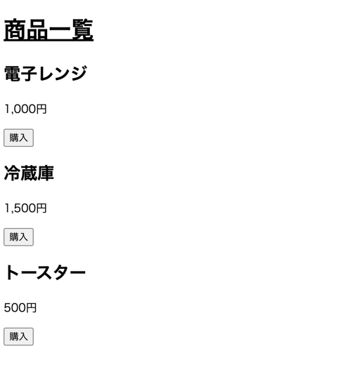
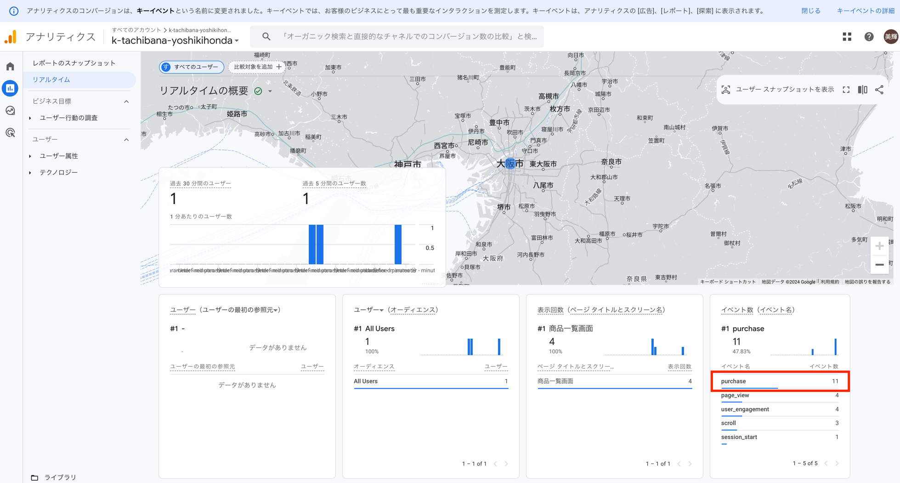
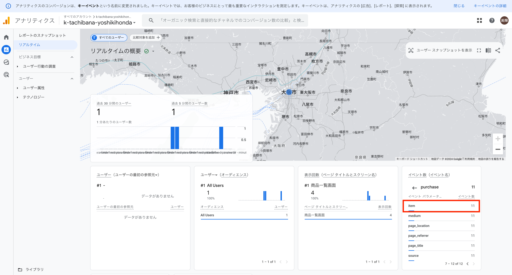
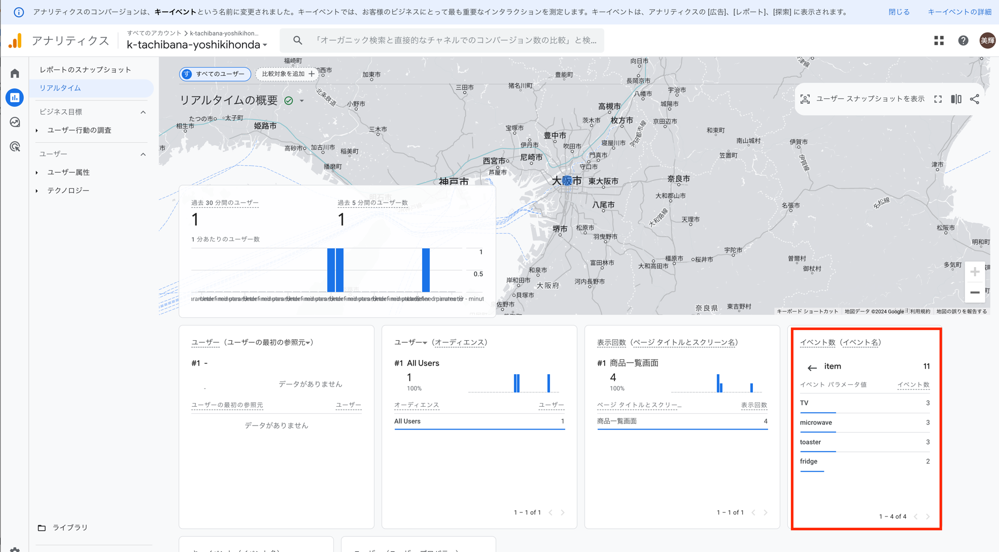

# 5. イベントをロギングする

## サンプル

こちらをコピーしていただいて構いません。 下記の `{自身のID}`の部分は先ほどの自身のIDを指定してください。 

```html
<!DOCTYPE html>
<html lang="en">
  <head>
    <meta charset="UTF-8" />
    <meta name="viewport" content="width=device-width, initial-scale=1.0" />
    <meta http-equiv="X-UA-Compatible" content="ie=edge" />
    <title>商品一覧画面</title>
    <link rel="stylesheet" href="styles.css" />
  </head>
  <body>
    <h1>商品一覧</h1>
    <h2>電子レンジ</h2>
    <p>1,000円</p>
    <button onclick="purchase('microwave')">購入</button>
    <h2>冷蔵庫</h2>
    <p>1,500円</p>
    <button onclick="purchase('fridge')">購入</button>
    <h2>トースター</h2>
    <p>500円</p>
    <button onclick="purchase('toaster')">購入</button>
  </body>
  <!-- Google tag (gtag.js) -->
  <script
    async
    src="https://www.googletagmanager.com/gtag/js?id={自身のID}"
  ></script>
  <script>
    window.dataLayer = window.dataLayer || [];
    function gtag() {
      dataLayer.push(arguments);
    }
    gtag("js", new Date());

    gtag("config", "{自身のID}");
    
    // 追加
    function purchase(itemName) {
      gtag("event", "purchase", {
        item: itemName,
      });
    }
  </script>
</html>
```



上記サンプルは、各商品の「購入」ボタンを押下すると「購入イベント」が送信されるものです。

試しに上記を実装して「購入」ボタンを押下してみると、Googleアナリティクスの「リアルタイムレポート」にて、購入イベント（purchaseイベント）が登録されていることがわかります。







### 解説

```Javascript
gtag("event", "purchase", {
  item: itemName,
});
```

gtag関数の第一引数に `"event"` を与えることでイベントを送信できます。第二引数の `"purchase"`はイベント名を指定できます。このイベント名は好きな文字列を設定することが可能です。第三引数の `{ item: itemName }` はイベントの属性です。今回はitemというパラメータに商品名を付与して送信しており、purchaseイベントのitemには「microwave」「fridge」「toaster」といった商品名が登録されていることがわかると思います。

### 注意

イベントの詳細情報は無料枠で使う場合はリアルタイム（直近１時間程度）でしか確認できません。
過去のイベントログの詳細を確認したい場合は Google Cloud Platformの**BigQuery**というサービスを使う必要があります。

これは従量課金制のサービスで今回は扱いません。本格的なログ分析をする場合は BigQueryを使うことになりますので知っておいてください。

- [BigQueryについて](https://cloud.google.com/bigquery?hl=ja)
- [GoogleアナリティクスとBigQueryについて](https://cloud.google.com/use-case/google-analytics-bigquery?hl=ja)


## 参考

- [gtagについて](https://developers.google.com/tag-platform/gtagjs/reference?hl=ja)
- [イベントについて](https://developers.google.com/tag-platform/gtagjs/reference?hl=ja#event)